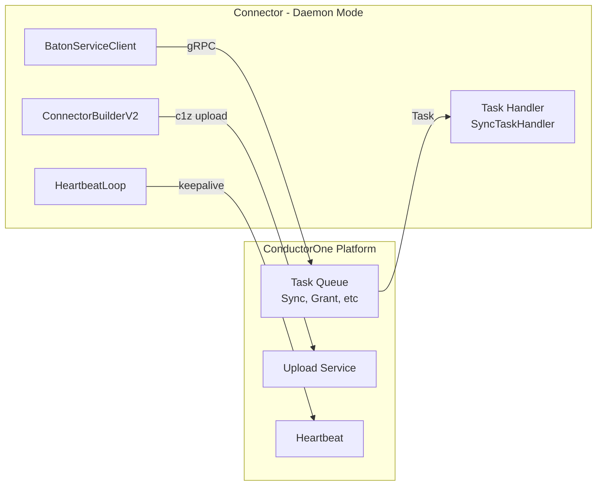

When running in daemon mode, connectors communicate with ConductorOne via gRPC. The SDK handles all API communication - connector developers implement interfaces, the SDK calls your code when tasks arrive.

This document describes the C1 APIs that connectors use internally. You don't call these APIs directly; the SDK manages them.

## Communication architecture



**Key points:**
- Connectors poll for tasks (pull model, not push)
- Tasks include: Sync, Grant, Revoke, CreateAccount, DeleteResource, RotateCredential
- Results upload via streaming (c1z files in 512KB chunks)
- Heartbeats keep tasks alive during long operations

## BatonServiceClient

The client interface used by connectors:

```go
type BatonServiceClient interface {
    // Initial connection handshake
    Hello(ctx context.Context, req *v1.BatonServiceHelloRequest,
    ) (*v1.BatonServiceHelloResponse, error)

    // Poll for next task
    GetTask(ctx context.Context, req *v1.BatonServiceGetTaskRequest,
    ) (*v1.BatonServiceGetTaskResponse, error)

    // Keep task alive during processing
    Heartbeat(ctx context.Context, req *v1.BatonServiceHeartbeatRequest,
    ) (*v1.BatonServiceHeartbeatResponse, error)

    // Report task completion
    FinishTask(ctx context.Context, req *v1.BatonServiceFinishTaskRequest,
    ) (*v1.BatonServiceFinishTaskResponse, error)

    // Upload sync output (c1z file)
    Upload(ctx context.Context, task *v1.Task, r io.ReadSeeker) error
}
```

## Task types

### Sync tasks

Full or targeted data sync from the external system:

```go
type SyncTask struct {
    SyncId           string
    ResourceTypes    []string   // Types to sync (empty = all)
    ResourceIds      []string   // Specific resources (targeted sync)
    SkipEntitlements bool
    SkipGrants       bool
}
```

**Connector produces:** c1z file uploaded to ConductorOne

### Grant task

Provision access to a user:

```go
type GrantTask struct {
    Entitlement *v2.Entitlement  // What access to grant
    Principal   *v2.Resource     // Who receives access
}
```

### Revoke task

Remove access from a user:

```go
type RevokeTask struct {
    Grant *v2.Grant  // The grant to revoke
}
```

### CreateAccount task

Provision a new user account (JIT):

```go
type CreateAccountTask struct {
    AccountInfo       *v2.AccountInfo
    CredentialOptions *v2.LocalCredentialOptions
}
```

**Returns to ConductorOne:** Created account, credentials (encrypted by SDK)

### DeleteResource task

```go
type DeleteResourceTask struct {
    ResourceId       *v2.ResourceId
    ParentResourceId *v2.ResourceId  // V2 only
}
```

### RotateCredential task

```go
type RotateCredentialTask struct {
    ResourceId        *v2.ResourceId
    CredentialOptions *v2.LocalCredentialOptions
}
```

**Returns to ConductorOne:** New credentials (encrypted by SDK)

## Task lifecycle

### Polling loop

```
Connector                                ConductorOne
    |                                        |
    |--- Hello (identify connector) -------->|
    |<-- HelloResponse (config) -------------|
    |                                        |
    |--- GetTask (poll for work) ----------->|
    |<-- Task or NoTask --------------------|
    |                                        |
    [If task received]                       |
    |                                        |
    |--- Heartbeat (keep alive) ------------>|  (every 30s)
    |<-- HeartbeatResponse ------------------|
    |                                        |
    |--- FinishTask (report result) -------->|
    |<-- FinishTaskResponse -----------------|
    |                                        |
    |--- Upload (c1z file, if sync) -------->|
    |<-- UploadComplete --------------------|
```

### Heartbeat intervals

```go
var (
    maxHeartbeatInterval     = 5 * time.Minute
    minHeartbeatInterval     = 1 * time.Second
    defaultHeartbeatInterval = 30 * time.Second
)
```

ConductorOne can adjust heartbeat interval per-task. If heartbeats stop, the task may be reassigned to another connector instance.

### Task completion

```go
// Successful completion
FinishTask(ctx, &v1.BatonServiceFinishTaskRequest{
    TaskId: task.Id,
    Status: v1.TaskStatus_TASK_STATUS_SUCCESS,
    Result: resultProto,
})

// Failed completion
FinishTask(ctx, &v1.BatonServiceFinishTaskRequest{
    TaskId: task.Id,
    Status: v1.TaskStatus_TASK_STATUS_FAILED,
    Error:  errorMessage,
})
```

## Upload mechanism

Sync results (c1z files) upload via streaming:

```go
const fileChunkSize = 512 * 1024  // 512KB chunks

func (c *client) Upload(ctx context.Context, task *v1.Task, r io.ReadSeeker) error {
    stream, err := c.client.Upload(ctx)

    for {
        chunk := make([]byte, fileChunkSize)
        n, err := r.Read(chunk)
        if err == io.EOF {
            break
        }
        stream.Send(&v1.BatonServiceUploadAssetRequest{
            Data: chunk[:n],
        })
    }

    return stream.CloseAndRecv()
}
```

**Upload characteristics:**
- Streaming (not buffered in memory)
- 512KB chunks
- Resumable on network errors
- Compressed c1z format

## Authentication

### Client credentials

Connectors authenticate using OAuth2 client credentials:

```bash
./baton-myservice \
    --client-id "your-client-id" \
    --client-secret "your-client-secret"
```

The SDK handles:
- Token acquisition from ConductorOne's OAuth endpoint
- Token refresh before expiration
- Token injection into request metadata

### Host identification

Connectors identify themselves to ConductorOne:

```go
hostId := os.Getenv("BATON_HOST_ID")
if hostId == "" {
    hostId, _ = os.Hostname()
}
```

This helps ConductorOne track which host is running which connector instance.

## Error handling

### Retryable vs non-retryable

```go
var (
    ErrTaskCancelled       = errors.New("task was cancelled")
    ErrTaskHeartbeatFailed = errors.New("task failed heartbeat")
    ErrTaskNonRetryable    = errors.New("task failed and is non-retryable")
)

taskMaximumHeartbeatFailures = 10
```

### Error flow

| Connector Error | SDK Handling | ConductorOne Action |
|-----------------|--------------|---------------------|
| Temporary failure | Retry with backoff | Task stays queued |
| Permanent failure | FinishTask(FAILED) | Task marked failed |
| Heartbeat timeout | Task abandoned | Reassign to other instance |
| Cancelled by ConductorOne | Stop processing | Task cancelled |

### Annotations for error context

Return annotations to provide context:

```go
func (g *groupBuilder) Grant(ctx context.Context, principal *v2.Resource,
    entitlement *v2.Entitlement) ([]*v2.Grant, annotations.Annotations, error) {

    err := g.client.AddMember(ctx, groupID, userID)
    if err != nil {
        annos := annotations.New()
        annos.Append(&v2.ErrorAnnotation{
            Message: fmt.Sprintf("API error: %v", err),
            Code:    "API_ERROR",
        })
        return nil, annos, err
    }

    return grants, nil, nil
}
```

## Debugging API communication

### Enable debug logging

```bash
./baton-myservice \
    --client-id ID \
    --client-secret SECRET \
    --log-level debug
```

Debug output includes:
- Task received notifications
- Heartbeat timing
- Upload progress
- API response codes

### Common issues

| Symptom | Likely Cause | Solution |
|---------|--------------|----------|
| `authentication error` | Invalid client credentials | Verify client-id/secret |
| `task heartbeat failed` | Processing too slow | Optimize or add heartbeats |
| `connection refused` | Network/firewall issue | Check connectivity to ConductorOne |
| `task cancelled` | Task timeout or user cancel | Check task duration |
| `upload failed` | Large c1z or network issue | Check file size, retry |

## Quick reference

### Daemon mode checklist

```bash
# Required for daemon mode
--client-id "your-oauth-client-id"
--client-secret "your-oauth-client-secret"

# Optional
--skip-full-sync          # Don't process sync tasks
--log-level debug         # Verbose logging
```

### Task processing flow

1. **Hello** - Connector identifies itself
2. **GetTask** - Poll for work (returns task or empty)
3. **Process** - Execute sync/grant/revoke/etc
4. **Heartbeat** - Keep task alive during processing
5. **FinishTask** - Report success or failure
6. **Upload** - Send c1z file (sync tasks only)

### SDK handles

- OAuth2 token management
- Connection pooling
- Heartbeat scheduling
- Chunk-based uploads
- Retry with backoff
- Error classification

<CardGroup cols={2}>
  <Card title="Configuration" icon="gear" href="/developer/config-schema">
    CLI flags and environment variables
  </Card>
  <Card title="Troubleshooting" icon="bug" href="/developer/debugging">
    Debug connector issues
  </Card>
</CardGroup>
