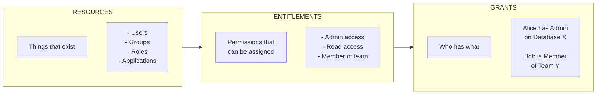
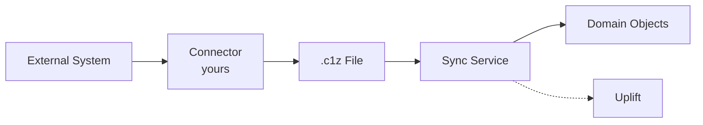

Every target system has its own vocabulary (teams vs groups, roles vs permission sets, projects vs workspaces). This diversity is a strength - each system evolved for its specific purpose. But it creates a challenge: how do you get unified visibility across all of them?

Baton solves this by normalizing every system into a consistent shape so ConductorOne can ask one question across all systems: who has access to what? Without this normalization, each system would be an island - auditors would see chaos, and access reviews would require expert knowledge of every platform.

The minimal "connector surface area" is expressed through the SDK's `ResourceSyncer` interface: list resources, list entitlements, list grants.

## The access graph

Your connector produces an access graph that powers access reviews, certification campaigns, provisioning workflows, and compliance reporting. This single data structure drives everything ConductorOne does. The graph has three main node/edge types:



- **Resources**: things that exist (users, groups, apps, roles, projects, etc.)
- **Entitlements**: permissions you can assign on a resource (member, admin, read, etc.)
- **Grants**: facts connecting principals to entitlements (Alice is a member of Engineering)

This is not a theoretical model: these are concrete protobuf types and services in the SDK.

### Hierarchical resources

Most access management systems flatten everything into a single list. Baton takes a different approach: resources can have parent-child relationships. This preserves the natural structure of your target systems.

Consider GitHub: organizations contain repositories, repositories have branches. Or AWS: accounts contain services, services have resources. When your connector models these hierarchies, ConductorOne can:

- Show access in context (this role applies to *this* project, not globally)
- Enable scoped access reviews (review all access within a single org unit)
- Support inheritance patterns where they exist in the target system

You express hierarchy through the `parentResourceID` parameter in your `List()` method. The SDK calls your `List()` first with no parent (top-level resources), then again for each parent that might have children. This inversion of control means you describe the structure; the SDK walks it.

## Resource types and traits

Every resource has a **resource type** (string id) and can declare **traits** that tell ConductorOne how to interpret it. Traits let ConductorOne understand *what kind of thing* a resource is, even when different systems call it different names.

```go
var userResourceType = &v2.ResourceType{
    Id:          "user",
    DisplayName: "User",
    Traits:      []v2.ResourceType_Trait{v2.ResourceType_TRAIT_USER},
}
```

The trait enum includes:
- `TRAIT_USER`
- `TRAIT_GROUP`
- `TRAIT_ROLE`
- `TRAIT_APP`
- `TRAIT_SECRET`
- `TRAIT_ROLE_SCOPE`

Traits are optional for custom resource types, but they unlock powerful features. When you mark a resource with `TRAIT_USER`, ConductorOne knows it can correlate that resource with users from other systems, display it in user-centric views, and apply user-specific policies.

| Trait | Use for |
|-------|---------|
| `TRAIT_USER` | Individual accounts |
| `TRAIT_GROUP` | Collections of users |
| `TRAIT_ROLE` | Permission sets |
| `TRAIT_APP` | Applications or services |
| `TRAIT_SECRET` | Credentials or tokens |
| `TRAIT_ROLE_SCOPE` | Permission boundaries (e.g., AWS accounts, GCP projects) |

### Entitlements

Entitlements define *what can be granted*. They're attached to resources - permissions don't float free in the system, they belong to something specific.

```go
// A group offers membership as an entitlement
entitlement := &v2.Entitlement{
    Id:          "member",
    DisplayName: "Member",
    Resource:    groupResource,
}
```

One resource can offer multiple entitlements. A GitHub repository might offer: read, write, maintain, admin.

#### Entitlement purpose

Entitlements have a `purpose` field that tells ConductorOne how to interpret them:

| Purpose | Use For | Example |
|---------|---------|---------|
| `assignment` | Membership or role assignment | "Member of Engineering Team" |
| `permission` | Specific permission on a resource | "Read access to Repository X" |
| `ownership` | Ownership or administrative control | "Owner of Project Y" |

### Grants

Grants record *who has what*:

```go
// Alice is a member of the engineering team
grant := &v2.Grant{
    Principal:   aliceResource,
    Entitlement: memberEntitlement,
}
```

Grants connect a **principal** (usually a user) to an **entitlement** (a permission on a resource).

## The sync lifecycle

Understanding the sync lifecycle helps you write cleaner code. The SDK orchestrates everything; you implement the callbacks. The "shape" of work per resource type is:
- Define type (`ResourceType`)
- List instances (`List`)
- For each resource instance, list entitlements (`Entitlements`)
- For each resource instance, list grants (`Grants`)

Each method is paginated: you return a list of results and a `nextPageToken` string (empty when done).

<Note>
The SDK detects a common pagination bug: returning the same next-page token you were given. This prevents infinite loops from subtle bugs.
</Note>

**Key insight:** The SDK processes ALL resource types together for each stage, not one resource type completely before the next. This "inversion of control" pattern keeps your connector code focused on data transformation rather than orchestration logic.

```
Stage 1: ResourceType()
  - SDK learns what resource types exist (user, group, role, etc.)

Stage 2: List()
  - SDK fetches all instances of each resource type
  - Returns: 127 users, 23 groups, 15 roles

Stage 3: Entitlements()
  - SDK asks each resource what entitlements it offers
  - Returns: group-A offers "member", role-X offers "assigned"

Stage 4: Grants()
  - SDK discovers who has each entitlement
  - Returns: alice has "member" on group-A, bob has "assigned" on role-X
```

### The sync pipeline

When a connector runs, data flows through several stages. The clean separation between what you control and what ConductorOne controls makes the system reliable and testable:



1. **Fetch** - Your connector calls the external API
2. **Transform** - Your connector creates Resource/Entitlement/Grant objects
3. **Output** - SDK writes objects to a .c1z file (gzip-compressed SQLite)
4. **Ingest** - ConductorOne's sync service reads the .c1z file
5. **Uplift** - Raw connector records become domain objects (Apps, Resources, Grants)

**What you control:** Steps 1-3. Your connector fetches, transforms, and outputs.

**What ConductorOne controls:** Steps 4-5. The sync service and uplift process.

### ID correlation

ConductorOne needs to know whether a resource in this sync is the same resource from a previous sync. This is where the `RawId` annotation matters.

When you build a resource, include its external system ID:

```go
resource, _ := resourceBuilder.NewGroupResource(
    group.Name,
    groupResourceType,
    group.Id,  // Used internally by SDK
    []resource.GroupTraitOption{},
)
// Add the external system's ID for correlation
resource.WithAnnotation(&v2.RawId{Id: group.Id})
```

The `RawId` annotation carries the external system's identifier through the pipeline:
- **Connector**: Sets `RawId` annotation on the resource
- **Sync storage**: Stored as `external_id` on the connector record
- **Domain objects**: Tracked in `source_connector_ids` map

This enables ConductorOne to:
- Correlate resources across syncs (same ID = same resource)
- Track which connector discovered which resource
- Support pre-sync reservation patterns

**What value to use:** The external system's native, stable identifier. For Okta, that's `app.Id`. For AWS, that's the ARN. For GCP, that's the project ID.

### ID vocabulary

These terms appear throughout ConductorOne when discussing identity correlation:

| Term | Where it appears | Purpose |
|------|-----------------|---------|
| **RawId** | Connector output annotation | External system's stable identifier, set by connector |
| **external_id** | Sync layer storage | Same value stored on ConnectorResource records |
| **source_connector_ids** | Domain objects | Map of connector_id to external_id for multi-connector scenarios |
| **raw_baton_id** | Domain objects | Set after merge; the canonical external ID |
| **match_baton_id** | Terraform/API | Pre-sync reservation (allows creating objects before connector discovers them) |

The flow is: `RawId` (connector) -> `external_id` (sync) -> `source_connector_ids` or `raw_baton_id` (domain).

## Modeling decisions

Your modeling choices expand or constrain what your organization can do with access control. Two connectors can both be "correct" and still produce very different experiences in ConductorOne:

- **Entitlement granularity**
  - Fine-grained (read/write/admin): more precision in reviews and provisioning, more total grants and API calls.
  - Coarse-grained (access/no-access): simpler, but you can't request/revoke specific privilege levels.

- **Capability surface**
  - Sync-only vs sync + provision (Grant/Revoke/Create/Delete)
  - Check per connector/version rather than assuming.

| Decision | Impact |
|----------|--------|
| **Granular entitlements** (read, write, admin separately) | More control, more complexity |
| **Coarse entitlements** (access vs no access) | Simpler, less visibility |
| **Group membership as grants** | Users can request to join groups |
| **Roles as resources** | Roles can be granted/revoked |

**Guidance:** Model what matters for access decisions. If you need to revoke admin access separately from read access, make them separate entitlements.

## Constraints and guardrails

The SDK includes guardrails that catch common mistakes early:

- **Pagination invariants**: your next token must progress; the SDK will detect and error on "same token" loops.
- **Optional advanced behaviors exist but are not universal**: targeted sync (`Get`), account management, resource deletion, credential rotation. Start with the basics; add these when you need them.

### Error handling

If an API call fails, return an error. The SDK handles retries for transient failures. For permanent failures (bad credentials, missing permissions), the sync stops with a clear error message.

### Rate limiting

Most APIs have rate limits. The SDK's HTTP client handles backoff automatically, but be mindful of page sizes - smaller pages mean more requests.

## Execution modes

Connectors can run in different modes:

| Mode | Trigger | Behavior |
|------|---------|----------|
| **One-shot** | No `--client-id` | Run, sync to file, exit |
| **Daemon** | `--client-id` provided | Connect to C1, process tasks continuously |

See [Deployment](/baton/deploy) for operational details on each mode.

## Quick reference

### Resource types

| Type | Description | Example |
|------|-------------|---------|
| User | Individual accounts | alice@company.com |
| Group | Collections of users | engineering-team |
| Role | Permission bundles | admin-role |
| App | Applications | billing-service |
| Team | GitHub/Slack style teams | platform-team |
| Project | Scoped containers | production-project |

### The four methods

Every resource syncer implements:

| Method | Purpose | Called |
|--------|---------|--------|
| `ResourceType()` | Define the resource type | Once per sync |
| `List()` | Fetch all instances | May be called multiple times (pagination) |
| `Entitlements()` | What permissions does this offer? | Once per resource instance |
| `Grants()` | Who has those permissions? | Once per entitlement |
