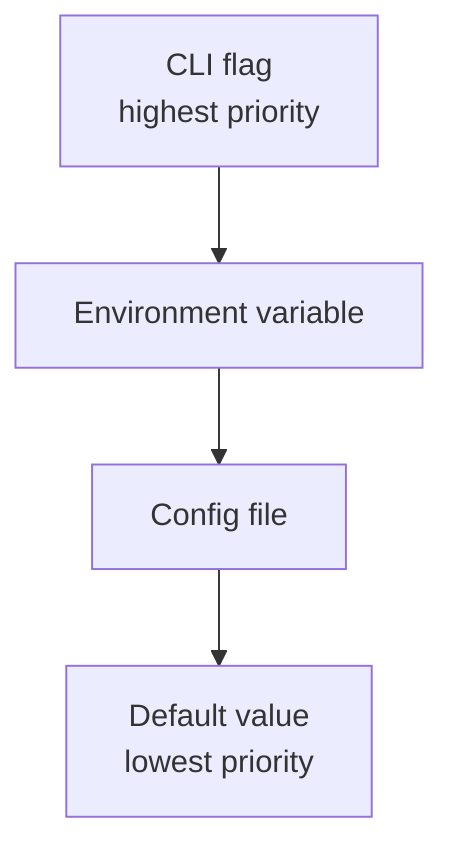

Every baton connector uses a type-safe configuration system. Configuration flows through three layers:
1. **CLI flags** (`--domain example.com`)
2. **Environment variables** (`BATON_DOMAIN=example.com`)
3. **Config files** (YAML)

CLI flags take precedence over environment variables, which take precedence over config files.

## Standard flags (all connectors)

Every connector automatically has these flags via the SDK.

### Output and logging

| Flag | Short | Type | Default | Description |
|------|-------|------|---------|-------------|
| `--file` | `-f` | string | `sync.c1z` | Output file path |
| `--log-level` | | string | `info` | `debug`, `info`, `warn`, `error` |
| `--log-format` | | string | auto | `json` or `console` (auto-detects TTY) |

### Daemon mode (service)

| Flag | Type | Description |
|------|------|-------------|
| `--client-id` | string | ConductorOne OAuth client ID (enables daemon mode) |
| `--client-secret` | string | ConductorOne OAuth client secret |
| `--skip-full-sync` | bool | Disable full sync in daemon mode |

### Provisioning operations

| Flag | Type | Description |
|------|------|-------------|
| `--provisioning` | bool | Enable provisioning mode |
| `--grant-entitlement` | string | Entitlement ID to grant |
| `--grant-principal` | string | Resource ID receiving grant |
| `--grant-principal-type` | string | Resource type of principal |
| `--revoke-grant` | string | Grant ID to revoke |

### Account management

| Flag | Type | Description |
|------|------|-------------|
| `--create-account-login` | string | Login for new account |
| `--create-account-email` | string | Email for new account |
| `--create-account-profile` | string | JSON profile data |
| `--delete-resource` | string | Resource ID to delete |
| `--delete-resource-type` | string | Resource type to delete |
| `--rotate-credentials` | string | Resource ID for rotation |
| `--rotate-credentials-type` | string | Resource type for rotation |

### Targeted sync

| Flag | Type | Description |
|------|------|-------------|
| `--sync-resources` | []string | Specific resource IDs to sync |
| `--sync-resource-types` | []string | Resource types to sync |
| `--skip-entitlements-and-grants` | bool | Skip E&G during sync |
| `--skip-grants` | bool | Skip only grants |

### Opentelemetry (operators)

| Flag | Type | Description |
|------|------|-------------|
| `--otel-collector-endpoint` | string | OTEL collector URL |
| `--otel-tracing-disabled` | bool | Disable tracing |
| `--otel-logging-disabled` | bool | Disable OTEL logging |

## Environment variables

All flags map to environment variables with the `BATON_` prefix:

```bash
--domain          -> BATON_DOMAIN
--api-key         -> BATON_API_KEY
--skip-ous        -> BATON_SKIP_OUS
--log-level       -> BATON_LOG_LEVEL
--client-id       -> BATON_CLIENT_ID
--client-secret   -> BATON_CLIENT_SECRET
```

**Rules:**
- Prefix: `BATON_`
- Dashes become underscores: `--base-dn` -> `BATON_BASE_DN`
- Case insensitive: `BATON_DOMAIN` = `baton_domain`

**Example:**

```bash
export BATON_DOMAIN=example.okta.com
export BATON_API_TOKEN=00abc123...
export BATON_LOG_LEVEL=debug

./baton-okta  # Uses env vars
```

## Config file format

Connectors can read YAML config files:

```yaml
# ~/.baton/config.yaml or specified via --config

domain: example.okta.com
api-token: "00abc123..."
log-level: debug

# Arrays
skip-groups:
  - "Test Group"
  - "Temp Users"

# Maps
custom-attributes:
  department: "Engineering"
  cost_center: "CC-1234"
```

**Config file locations (checked in order):**
1. Path specified via `--config` flag
2. `./baton.yaml`
3. `~/.baton/config.yaml`

## Field types

When building a connector, you define fields using these types:

### StringField

```go
field.StringField("domain",
    field.WithRequired(true),
    field.WithDescription("Your Okta domain"),
    field.WithPlaceholder("example.okta.com"),
)
```

CLI: `--domain example.okta.com`
Env: `BATON_DOMAIN=example.okta.com`

### BoolField

```go
field.BoolField("ldaps",
    field.WithDescription("Use LDAPS encryption"),
    field.WithDefaultValue(false),
)
```

CLI: `--ldaps` or `--ldaps=true`
Env: `BATON_LDAPS=true`

### IntField

```go
field.IntField("port",
    field.WithDescription("LDAP port"),
    field.WithDefaultValue(389),
)
```

CLI: `--port 636`
Env: `BATON_PORT=636`

### StringSliceField

```go
field.StringSliceField("skip-groups",
    field.WithDescription("Groups to exclude from sync"),
)
```

CLI: `--skip-groups "Group1" --skip-groups "Group2"`
Env: `BATON_SKIP_GROUPS="Group1,Group2"`

### SelectField (enum)

```go
field.SelectField("auth-type", []string{"token", "oauth", "basic"},
    field.WithDescription("Authentication method"),
    field.WithDefaultValue("token"),
)
```

CLI: `--auth-type oauth`

## Field options

### Required fields

```go
field.StringField("api-key",
    field.WithRequired(true),
)
```

Error if missing: `required flag "api-key" not set`

### Secret fields

```go
field.StringField("api-token",
    field.WithIsSecret(true),
)
```

Secrets are:
- Not printed in debug logs
- Masked as `***` in GUI
- Stored securely in config

### Default values

```go
field.IntField("timeout",
    field.WithDefaultValue(30),
)
```

### Hidden fields

```go
field.StringField("internal-id",
    field.WithHidden(true),  // Not shown in --help
)
```

### Shorthand flags

```go
field.StringField("file",
    field.WithShortHand("f"),  // Enables -f shortcut
)
```

## Validation rules

### String validation

```go
field.StringField("domain",
    field.WithString(func(r *field.StringRuler) {
        r.MinLen(3)
        r.MaxLen(253)
        r.Pattern(`^[a-z0-9.-]+$`)
        r.Prefix("https://")
        r.Suffix(".com")
        r.Contains("okta")
    }),
)
```

### Integer validation

```go
field.IntField("port",
    field.WithInt(func(r *field.IntRuler) {
        r.Gt(0)
        r.Lt(65536)
        r.Gte(1024)
        r.Lte(49151)
        r.In([]int64{80, 443, 8080})
        r.NotIn([]int64{22, 23})
    }),
)
```

## Field relationships

### Required together

Both must be provided or neither:

```go
field.FieldsRequiredTogether(
    bindUserField,
    bindPasswordField,
)
```

### Mutually exclusive

Only one can be provided:

```go
field.FieldsMutuallyExclusive(
    skipGroupsField,
    onlyGroupsField,
)
```

### At least one required

```go
field.FieldsAtLeastOneUsed(
    apiKeyField,
    oauthTokenField,
    usernameField,
)
```

### Dependent fields

```go
field.FieldsDependentOn(
    []field.SchemaField{proxyField},
    []field.SchemaField{proxyUserField, proxyPasswordField},
)
```

## Configuration precedence

When the same setting is specified multiple ways:



## Quick reference

### Common patterns

| Use Case | Flags |
|----------|-------|
| Debug sync | `--log-level debug` |
| Custom output | `-f /path/to/output.c1z` |
| Daemon mode | `--client-id ID --client-secret SECRET` |
| Targeted sync | `--sync-resource-types user,group` |
| Test provisioning | `-p --grant-entitlement ENT --grant-principal PRIN` |

### Check connector-specific flags

```bash
./baton-okta --help
./baton-github --help
./baton-aws --help
```

<CardGroup cols={2}>
  <Card title="Baton SDK" icon="book" href="/developer/baton-sdk">
    SDK interface reference
  </Card>
  <Card title="C1 API integration" icon="plug" href="/developer/c1-api">
    Platform communication details
  </Card>
</CardGroup>
