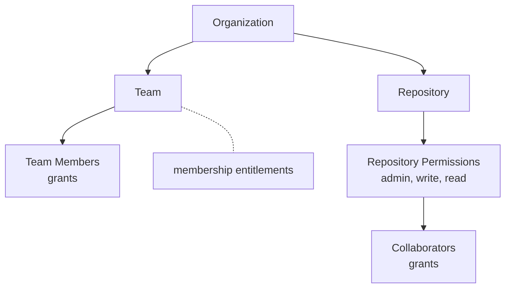

Always paginate. Even if your test environment has 10 users, production might have 10,000. The SDK handles pagination orchestration - use it from day one.

## Basic pattern

Every `List()`, `Entitlements()`, and `Grants()` method returns a next page token:

```go
// Return next page token, or "" when done
return resources, nextPageToken, nil, nil
```

The SDK calls your method repeatedly until you return an empty token. Your job: fetch and convert one page at a time.

<Tip>
**Use the API's next token for termination**, not result count. Some APIs return empty pages before the final page, so `len(results) < pageSize` isn't reliable. Return `""` only when the API signals no more pages.
</Tip>

## Pagination strategies

APIs paginate results differently. Your connector adapts the token to whatever the API expects:

| Strategy | How it works | Example APIs |
|----------|--------------|--------------|
| **Cursor-based** | Opaque token in response | Most modern APIs (Slack, Stripe) |
| **Offset-based** | `?offset=100&limit=50` | Traditional REST APIs |
| **Page number** | `?page=3&per_page=50` | Some REST APIs |
| **Link header** | RFC 5988 Link relations | GitHub API |
| **LDAP paging** | Server-side cookie | Active Directory |
| **GraphQL cursors** | `after: "cursor"` | GitHub GraphQL, Shopify |

### Cursor-based (most modern APIs)

```go
func (u *userBuilder) List(ctx context.Context, _ *v2.ResourceId,
    pToken *pagination.Token) ([]*v2.Resource, string, annotations.Annotations, error) {

    resp, err := u.client.ListUsers(ctx, pToken.Token)
    if err != nil {
        return nil, "", nil, err
    }

    var resources []*v2.Resource
    for _, user := range resp.Users {
        r, _ := resource.NewUserResource(user.Name, userType, user.ID)
        resources = append(resources, r)
    }

    // API returns opaque cursor for next page
    return resources, resp.NextCursor, nil, nil
}
```

### Offset-based (traditional REST)

```go
func (u *userBuilder) List(ctx context.Context, _ *v2.ResourceId,
    pToken *pagination.Token) ([]*v2.Resource, string, annotations.Annotations, error) {

    const limit = 100
    offset := 0
    if pToken.Token != "" {
        offset, _ = strconv.Atoi(pToken.Token)
    }

    resp, err := u.client.ListUsers(ctx, offset, limit)
    if err != nil {
        return nil, "", nil, err
    }

    var resources []*v2.Resource
    for _, user := range resp.Users {
        r, _ := resource.NewUserResource(user.Name, userType, user.ID)
        resources = append(resources, r)
    }

    // Calculate next offset
    nextToken := ""
    if len(resp.Users) == limit {
        nextToken = strconv.Itoa(offset + limit)
    }

    return resources, nextToken, nil, nil
}
```

### LDAP paging (Active Directory)

```go
func (u *userBuilder) List(ctx context.Context, _ *v2.ResourceId,
    pToken *pagination.Token) ([]*v2.Resource, string, annotations.Annotations, error) {

    const pageSize = 1000
    pagingControl := ldap.NewControlPaging(pageSize)

    // Restore cookie from previous page
    if pToken.Token != "" {
        cookie, _ := base64.StdEncoding.DecodeString(pToken.Token)
        pagingControl.SetCookie(cookie)
    }

    searchRequest := ldap.NewSearchRequest(
        "dc=example,dc=com",
        ldap.ScopeWholeSubtree, ldap.NeverDerefAliases, 0, 0, false,
        "(objectClass=user)",
        []string{"distinguishedName", "sAMAccountName", "mail"},
        []ldap.Control{pagingControl},
    )

    result, err := u.conn.Search(searchRequest)
    if err != nil {
        return nil, "", nil, err
    }

    var resources []*v2.Resource
    for _, entry := range result.Entries {
        r, _ := resource.NewUserResource(
            entry.GetAttributeValue("sAMAccountName"),
            userType,
            entry.GetAttributeValue("distinguishedName"))
        resources = append(resources, r)
    }

    // Extract cookie for next page
    nextToken := ""
    if ctrl := ldap.FindControl(result.Controls, ldap.ControlTypePaging); ctrl != nil {
        if pc, ok := ctrl.(*ldap.ControlPaging); ok && len(pc.Cookie) > 0 {
            nextToken = base64.StdEncoding.EncodeToString(pc.Cookie)
        }
    }

    return resources, nextToken, nil, nil
}
```

## Nested pagination with Bag

When you have hierarchies, you often need to paginate at multiple levels: "page through orgs, and for each org, page through repos." The SDK's `pagination.Bag` handles this.

### How Bag works

The `Bag` acts as a stack for managing complex pagination state:

```go
type Bag struct {
    states       []PageState
    currentState *PageState
}

type PageState struct {
    Token          string `json:"token,omitempty"`
    ResourceTypeID string `json:"type,omitempty"`
    ResourceID     string `json:"id,omitempty"`
}
```

Key methods:
- `Push(state PageState)` - Push new pagination state onto stack
- `Pop() *PageState` - Pop current state, make top of stack current
- `Next(pageToken string)` - Update current state with new page token
- `Current() *PageState` - Get current state (may be nil)
- `Marshal() (string, error)` - Serialize state to opaque token
- `Unmarshal(token string) error` - Restore state from token

### Example: paginating repos within orgs

```go
func (r *repoBuilder) List(ctx context.Context, parentID *v2.ResourceId,
    pToken *pagination.Token) ([]*v2.Resource, string, annotations.Annotations, error) {

    bag := &pagination.Bag{}
    if pToken != nil && pToken.Token != "" {
        // Restore state from previous call
        if err := bag.Unmarshal(pToken.Token); err != nil {
            return nil, "", nil, err
        }
    }

    // Get current pagination state
    // IMPORTANT: bag.Current() returns nil on first call before any Push()
    state := bag.Current()
    pageToken := ""
    if state != nil {
        pageToken = state.Token
    }

    // Fetch page of repos for this org
    repos, nextPage, err := r.client.ListRepos(ctx, parentID.Resource, pageToken)
    if err != nil {
        return nil, "", nil, err
    }

    // Build resources
    var resources []*v2.Resource
    for _, repo := range repos {
        res, _ := resource.NewResource(repo.Name, repoType, repo.ID,
            resource.WithParentResourceID(parentID))
        resources = append(resources, res)
    }

    // Update state with next page token
    if nextPage != "" {
        bag.Next(nextPage)
    }

    // Marshal state for next call
    nextToken, err := bag.Marshal()
    if err != nil {
        return nil, "", nil, err
    }

    return resources, nextToken, nil, nil
}
```

<Warning>
**Bag.Current() nil safety:** The `Bag` starts empty. `Current()` returns nil until you `Push()` a state. Always check for nil before accessing fields.
</Warning>

### Multi-level nested pagination

For deeper hierarchies (org -> team -> members), push and pop states:

```go
func (m *memberBuilder) Grants(ctx context.Context, resource *v2.Resource,
    pToken *pagination.Token) ([]*v2.Grant, string, annotations.Annotations, error) {

    bag := &pagination.Bag{}
    if pToken.Token != "" {
        bag.Unmarshal(pToken.Token)
    }

    // First call: initialize state
    if bag.Current() == nil {
        bag.Push(pagination.PageState{ResourceID: resource.Id.Resource})
    }

    state := bag.Current()
    members, nextPage, err := m.client.ListTeamMembers(ctx, state.ResourceID, state.Token)
    if err != nil {
        return nil, "", nil, err
    }

    var grants []*v2.Grant
    for _, member := range members {
        g := grant.NewGrant(resource, "member",
            &v2.ResourceId{ResourceType: "user", Resource: member.ID})
        grants = append(grants, g)
    }

    if nextPage != "" {
        bag.Next(nextPage)
    } else {
        bag.Pop()  // Done with this resource, pop state
    }

    nextToken, _ := bag.Marshal()
    return grants, nextToken, nil, nil
}
```

## Modeling hierarchies

Real systems often have deep hierarchies. The Baton model handles these naturally: declare parent-child relationships and the SDK walks the tree for you.

### Two mechanisms connect parent and child

**1. Parent declares child types** via `ChildResourceType` annotation:

```go
orgResource, _ := resource.NewResource("Acme Corp", orgType, "org-123",
    resource.WithAnnotation(&v2.ChildResourceType{ResourceTypeId: "repository"}),
    resource.WithAnnotation(&v2.ChildResourceType{ResourceTypeId: "team"}))
```

**2. Child references parent** via `ParentResourceID`:

```go
repoResource, _ := resource.NewResource("api-service", repoType, "repo-456",
    resource.WithParentResourceID(&v2.ResourceId{
        ResourceType: "organization",
        Resource:     "org-123",
    }))
```

When the SDK calls `List()` for child resources, it passes the parent's `ResourceId` so you can scope your API calls.

### Example: GitHub hierarchy



**Organization builder:**

```go
func (o *orgBuilder) List(ctx context.Context, _ *v2.ResourceId,
    pToken *pagination.Token) ([]*v2.Resource, string, annotations.Annotations, error) {

    orgs, next, err := o.client.ListOrganizations(ctx, pToken.Token)
    if err != nil {
        return nil, "", nil, err
    }

    var resources []*v2.Resource
    for _, org := range orgs {
        r, _ := resource.NewResource(org.Name, orgType, org.ID,
            // Declare child types
            resource.WithAnnotation(&v2.ChildResourceType{ResourceTypeId: "team"}),
            resource.WithAnnotation(&v2.ChildResourceType{ResourceTypeId: "repository"}))
        resources = append(resources, r)
    }
    return resources, next, nil, nil
}
```

**Repository builder - receives parent org in List():**

```go
func (r *repoBuilder) List(ctx context.Context, parentID *v2.ResourceId,
    pToken *pagination.Token) ([]*v2.Resource, string, annotations.Annotations, error) {

    // parentID.Resource contains the org ID
    repos, next, err := r.client.ListOrgRepos(ctx, parentID.Resource, pToken.Token)
    if err != nil {
        return nil, "", nil, err
    }

    var resources []*v2.Resource
    for _, repo := range repos {
        res, _ := resource.NewResource(repo.Name, repoType, repo.ID,
            resource.WithParentResourceID(parentID))  // Link to parent org
        resources = append(resources, res)
    }
    return resources, next, nil, nil
}
```

### When to use hierarchies vs flat models

| Use hierarchies when... | Use flat models when... |
|------------------------|------------------------|
| Resources only exist within a parent (repos in orgs) | Resources are independent (standalone users) |
| API requires parent context to list children | API lists all resources globally |
| Access is scoped by parent (org-level vs repo-level) | Access is global |
| You need to express "admin of org X" vs "admin of repo Y" | All instances have the same entitlement shape |

## Common hierarchy mistakes

| Mistake | Consequence | Fix |
|---------|-------------|-----|
| Missing `ChildResourceType` annotation | SDK doesn't know to call List() for children | Add annotation to parent |
| Wrong `ParentResourceID` type | Child appears orphaned | Match exact type ID string |
| Not using `parentID` in List() | Returns all resources, not just children | Scope API call to parent |
| Flat model for hierarchical data | Loses context (which org owns this repo?) | Add parent-child links |
| Over-deep hierarchies | Sync takes too long | Flatten where parent context isn't needed |

## Pagination invariants

The SDK enforces invariants to catch common bugs:

- **Token must progress**: Returning the same token you received causes an error. This prevents infinite loops.
- **Empty token means done**: Return `""` when there are no more pages.
- **Consistent page sizes**: While not enforced, use consistent page sizes for predictable behavior.

<Tip>
Test with small page sizes (10-20 items) during development to verify pagination works correctly before testing with production-sized datasets.
</Tip>
