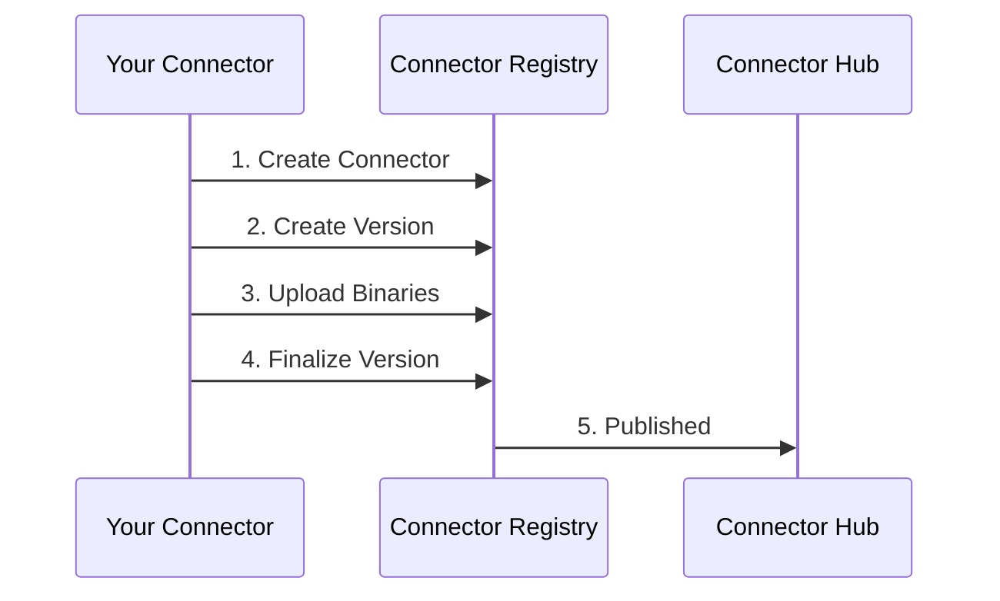
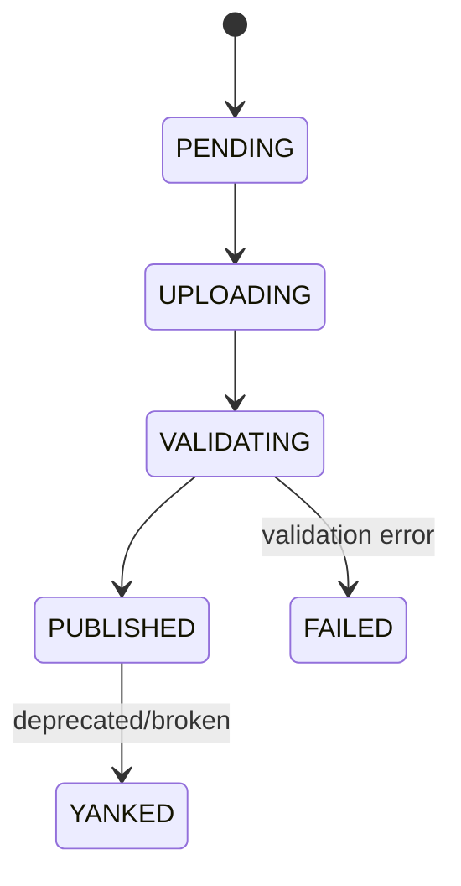

You've built a connector that works. Publishing makes it available to everyone using ConductorOne:
- Other organizations can deploy it
- It appears in the Connector Hub
- It becomes eligible for hosted mode (ConductorOne runs it for customers)
- The community can contribute improvements

## Publishing flow



### Version lifecycle



| State | Meaning |
|-------|---------|
| `PENDING` | Version created, awaiting asset uploads |
| `UPLOADING` | Assets are being uploaded |
| `VALIDATING` | Assets uploaded, validation in progress |
| `PUBLISHED` | Version available for download |
| `YANKED` | Version withdrawn (still visible but marked) |
| `FAILED` | Validation failed |

## Publishing paths

### Contributing to existing connectors

Before building a new connector, check if one already exists. If it does but lacks features you need:

**Option A: Contribute upstream**
- Fork the repository
- Add your changes
- Submit a pull request
- Maintainers review and merge
- New version published with your changes

**Option B: Fork and maintain**
- Fork the repository
- Publish under your organization
- Maintain independently

### New connectors

**Option A: Open source under ConductorOne**
- Work with ConductorOne to host in their GitHub org
- Benefits from existing CI/CD and publishing infrastructure

**Option B: Open source under your organization**
- Host in your own GitHub organization
- Publish to registry under your org name
- Full control, full responsibility

**Option C: Internal only**
- Don't publish to the public registry
- Deploy in daemon mode on your infrastructure
- Suitable for proprietary internal systems

## Supported platforms

| Platform | GOOS | GOARCH |
|----------|------|--------|
| darwin-amd64 | darwin | amd64 |
| darwin-arm64 | darwin | arm64 |
| linux-amd64 | linux | amd64 |
| linux-arm64 | linux | arm64 |
| windows-amd64 | windows | amd64 |

### Signing keys

Connectors can be signed with:

| Type | Description |
|------|-------------|
| `GPG` | GnuPG signatures |
| `COSIGN` | Sigstore cosign signatures |

## Contributing a connector

### Before you start

1. **Check for existing connectors**: Search the Connector Hub for your target system. If one exists, consider contributing improvements rather than building from scratch.

2. **Review the SDK**: Familiarize yourself with the [baton-sdk](https://github.com/ConductorOne/baton-sdk) and the building connectors guide.

3. **Understand the target system's API**: You'll need API credentials with sufficient permissions to list users, groups, roles, and other access-related resources.

### Implementation requirements

Your connector must meet these requirements before submission:

| Requirement | Details |
|-------------|---------|
| **ResourceSyncer interface** | Implement `ResourceType()`, `List()`, `Entitlements()`, `Grants()` |
| **Lint checks pass** | Run `make lint` with standard golangci-lint configuration |
| **Tests included** | Unit tests for resource builders; integration tests recommended |
| **README.md** | Document API permissions required, configuration options, usage examples |
| **License** | Apache 2.0 (standard for Baton ecosystem) |
| **Capabilities manifest** | Include `baton_capabilities.json` declaring supported operations |

### Pull request process

#### For existing connectors

```bash
# Fork the repository
gh repo fork ConductorOne/baton-yourservice
cd baton-yourservice

# Create a feature branch
git checkout -b feature/add-role-support

# Make your changes, then run local validation
make build
make lint
make test
./dist/*/baton-yourservice --help

# Submit a pull request
```

#### For new connectors

1. Use the standard project structure
2. Ensure CI/CD is configured with standard GitHub workflows
3. Contact ConductorOne if you want official hosting:
   - Open an issue on [baton-sdk](https://github.com/ConductorOne/baton-sdk/issues)
   - Include: target system name, API documentation link, your use case
4. Or publish independently under your organization

### Review criteria

| Criterion | What reviewers check |
|-----------|---------------------|
| **Correctness** | Does it accurately model the target system's access structure? |
| **Completeness** | Are all relevant resource types included? |
| **Code quality** | Does it follow SDK patterns and pass lint? |
| **Test coverage** | Are there tests for the key behaviors? |
| **Documentation** | Is the README clear and complete? |
| **Security** | No credentials logged, proper error handling |

### Security reporting

If you discover a security issue:

- **DO NOT** file a public issue
- **DO** send a private report to [security@conductorone.com](mailto:security@conductorone.com)

Security researchers are publicly thanked for responsible disclosure.

## Quick reference

### Registry API methods

| Method | Description |
|--------|-------------|
| `CreateConnector` | Register a new connector |
| `CreateVersion` | Create a new version |
| `GetUploadURLs` | Get presigned upload URLs |
| `FinalizeVersion` | Complete upload and validate |
| `YankVersion` | Mark version as yanked |

<CardGroup cols={2}>
  <Card title="Building connectors" icon="wrench" href="/developer/syncing">
    Implementation guide
  </Card>
  <Card title="Community" icon="users" href="/developer/community">
    Get help and contribute
  </Card>
</CardGroup>
