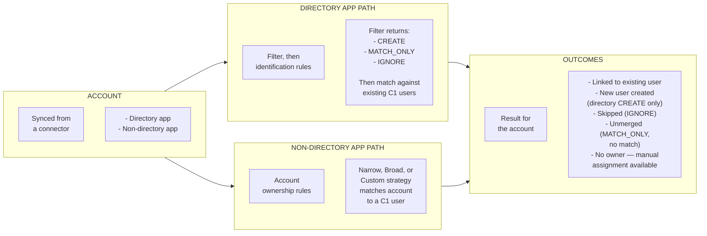

{/* Editor Refresh: 2026-01-07 */}

## What is a directory?

An application that holds a record for every person in your organization should be designated as your directory in C1.

This single source of truth is typically one of these:

* Your Identity Provider (IdP), such as Okta, Azure AD, or Google Workspace.

* Your Human Resources Information System (HRIS), such as BambooHR or Workday, especially if it serves as the ultimate source of truth for all employee records.

* [A custom app](/product/admin/applications#create-a-new-application) using a spreadsheet or CSV of employee data.

Once the directory is designated, C1 uses its data to automatically create C1 user accounts for everyone in your company.

## Account to user flow

Every account from every connector takes one of two paths before it becomes — or attaches to — a C1 user, depending on whether the connector is on your directory app. Directory apps drive identity creation; accounts from non-directory apps attach to users that already exist.

### Key terms

- **[Account](/product/glossary#account)** — A unique record for an actor (a human, a service account, or a system account) inside an application.
- **[User](/product/glossary#user)** — A human at your organization whose access data is synced to C1 and who can be assigned tasks in C1.
- **[Directory filter](/product/admin/directory#optional-limit-which-accounts-will-be-pulled-into-c1)** — A CEL expression that decides whether an account from your directory should create (or match) a C1 user.
- **[User identification rules](/product/admin/directory#configure-merge-matching)** — The merge-matching rules that determine whether an incoming directory account links to an existing C1 user instead of creating a new one.
- **[Account ownership rules](/product/admin/managing-accounts#auto-match-accounts-with-users)** — The matching strategy (Narrow, Broad, or Custom) used to assign an account from a non-directory app to a C1 user as its owner.

Directory apps that pass the filter with `CREATE` either link to an existing user or seed a new one. `MATCH_ONLY` accounts only attach to users that already exist. Accounts from non-directory apps don't create users — they find an owner via account ownership rules, or wait for manual assignment.

### Common scenarios

#### One person, many apps

A user has accounts in Okta, GitHub, Workday, and Slack. All four accounts link to one C1 user via primary-email match, and profile attributes are aggregated from each app according to the configured [attribute mapping priorities](/product/admin/attributes).

#### Identity provider plus apps

When an IdP connector (Okta, Entra ID) is configured, it typically syncs the largest set of identities and serves as the de-facto source of truth — most other apps' accounts find a C1 user to link to via the IdP's primary emails. The IdP also produces an IdP record per user, which keeps the C1 user retained for audit even after every other account is removed.

#### Service account aliased to a human

A human's secondary email is also listed as a service-account address in your directory app. Without intervention, the alias-email match path can link the service-account to the human's C1 user. Resolve this by unlinking the service account in the C1 UI, or by filtering service accounts out at the [directory level](/product/admin/directory#optional-limit-which-accounts-will-be-pulled-into-c1) using `IGNORE`. For service accounts in non-directory apps, only the UI unlink applies.

#### MATCH_ONLY directory for shadow imports

A secondary HR system is configured in `MATCH_ONLY` mode so its accounts can enrich C1 users with HR attributes (employee ID, manager, etc.) without inflating the user count. Accounts from that directory that don't match an existing C1 user are left unmerged until a primary-directory account creates the identity.

## Connect a directory and create user accounts

As part of setting up C1 for your organization, designate a key app as your directory, which will serve as the source of truth for creating C1 user accounts. 

### Step 1: Integrate an app that holds employee records

First, [set up an application in C1](/product/admin/applications#create-a-new-application) that holds a record for each employee, such as your HR system or your identity provider (IdP). 

Browse the [connectors library](/baton/intro) for a list of available direct integrations, and [let us know](mailto:support@c1.ai) if you don't find what you're looking for. 

You can also [create a new app](/product/admin/applications#create-a-new-application) using a spreadsheet or CSV of key employee data as the data source.

### Step 2: Set the app as the directory

Next, tell C1 that the app you've integrated is your directory. 

<Steps>
<Step>
Navigate to **Directory** - **User data sources**.

</Step>
<Step>
On the **Directories** tab, click **Add directory data source**. 
</Step>
<Step>
Select an application in the dropdown. Only apps that have been set up and synced at least once are available to select. 
</Step>
<Step>
**Optional.** Follow the docs if you want to [limit which accounts will be pulled into C1](/product/admin/directory#optional-limit-which-accounts-will-be-pulled-into-c1) or [specify a custom merge matching strategy](/product/admin/directory#configure-merge-matching). You can also edit these settings later if you're not ready to configure them now.
</Step>
<Step>
Click **Create directory**.
</Step>
</Steps>

### Optional: Limit which accounts will be pulled into C1

By default, C1 creates users for all accounts in a designated directory. If you want to create users from only a subset of a directory's accounts, you can do so: 

<Steps>
<Step>
Click the directory's **...** (more actions) menu and select **Edit**. 

</Step>
<Step>
Click **CEL expression** and enter an [enter an expression that returns true for the accounts you want to create users for](/product/admin/expressions-reference). 

   <Tip>
    **What your CEL expression can return**

    Your expression decides what C1 should do with each account it sees. It can return a Boolean for a simple include/exclude, or a string for finer control:

    * "CREATE" (or true) — Match this account to an existing C1 user, or create a new C1 user from it if no match exists. This is the default behavior for accounts that pass the filter.
    * "MATCH_ONLY" — Link this account to an existing C1 user only; never create a new C1 user from it. Use this for accounts you want represented in C1 if a person already exists, but that should not add anyone to your roster.
    * "IGNORE" (or false) — Skip this account entirely. It is not matched to anyone and no C1 user is created from it. The account still exists in its source app, but it does not contribute to any C1 user identity.
    </Tip>

</Step>
<Step>
Click **Update**. 
</Step>
</Steps>

Your CEL expression is now shown in the directory's **Account import condition** column, and the directory will create users from only the accounts that match the expression. Any existing C1 users who do not match the new condition will be removed on the next directory sync. 

### Step 3: C1 creates user accounts from your directory app

When an app is set as a directory, C1 automatically uses the info in the directory's accounts to create C1 user accounts. Each user's email address is the key data point. 

Accounts from various apps integrated with C1 are all tied to the same human user because they all share an email address.

## Configure merge matching

By default, C1 matches directory accounts to C1 users by comparing email address and employee ID. Custom merge matching lets you replace those rules with your own ordered set — useful when your directory uses different identifiers or when you need finer control over how accounts are linked.

These settings are available both when adding a new directory and when editing an existing one.

<Steps>
<Step>
Navigate to **Directory** > **User data sources**.
</Step>
<Step>
Open directory settings by doing one of the following:

- To configure an existing directory, click its **...** (more actions) menu and select **Edit**.
- To configure during initial setup, click **Add directory data source** and proceed through the setup flow.
</Step>
<Step>
In the **Custom merge matching** section, select **Custom - define custom matching rules**.

The rules list pre-populates with the default rules as a starting point.
</Step>
<Step>
Configure your rules. Each rule pairs a **Directory source account field** with a **C1 user field**. Available fields are: **Primary email**, **All emails**, **Username**, **Display name**, and **Employee ID**.

For email fields, check **Remove + suffix** to normalize addresses before comparing — for example, `user+tag@example.com` is treated as `user@example.com`.

To write a custom [CEL expression](/product/admin/expressions) instead of using a preset field, click the **Switch to CEL expression** icon.
</Step>
<Step>
Add, remove, or reorder rules as needed. Rules are evaluated in order — C1 uses the first rule that produces a match.
</Step>
<Step>
Click **Update**.
</Step>
</Steps>

**Done.** C1 will use your custom merge rules on the next directory sync.

To revert to default matching at any time, select **Default - match on email and employee ID** and click **Update**.

