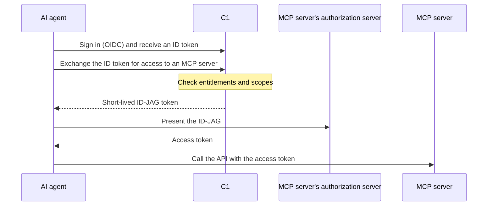

{/* Editor Refresh: 2026-06-13 */}

<Warning>
**Early access.** This feature is in early access, which means it's undergoing ongoing testing and development while we gather feedback, validate functionality, and improve outputs. Contact the C1 Support team if you'd like to try it out or share feedback.
</Warning>

Enterprise-managed authorization (EMA) governs how AI agents — Claude, VS Code, and others — reach the MCP servers your organization runs. Your people authenticate once to C1, and from then on their agents get short-lived, scoped access to the MCP servers they're entitled to. It's single sign-on for agents: the same identity governance you already apply to people, applied to the agents acting on their behalf.

Instead of handing an agent a long-lived API key, C1 exchanges the signed-in user's identity for a short-lived, scoped token addressed to one specific MCP server. C1 checks your access policy before it issues the token and records the decision.

## What your users see

The capability shows up in each AI client under the client's own name. When a user turns it on there, what they're enabling is the same thing you configure in C1:

- **In Claude** — "enterprise-managed auth," surfaced through connectors.
- **In VS Code** — "enterprise-managed MCP authentication."

The job of these docs is to connect *the thing your users enabled in their AI client* to *the thing you configure in C1*.

## The two paths C1 governs

An AI agent can reach one of your MCP servers in two ways, and C1 governs both under one set of entitlements, one policy engine, and one audit trail.

| | Enterprise-managed authorization (this page) | AI access management gateway |
| :--- | :--- | :--- |
| **When to use it** | The MCP server supports enterprise-managed authorization (the Cross-App Access standard) | The MCP server does not support the standard |
| **How the agent connects** | C1 issues a scoped token; the agent calls the server directly | The agent routes its calls through C1's MCP gateway |
| **Is C1 in the data path?** | No. C1 issues the token and is not in the call path | Yes. C1 proxies each call and enforces policy on it |
| **Where enforcement happens** | At token issuance; the server enforces the scope after that | On every tool call, in real time |

Use enterprise-managed authorization for MCP servers that can verify C1-issued tokens. For everything else, use the [AI access management gateway](/product/admin/aiam-overview), which proxies and enforces each call. Many tenants run both.

## Why enterprise-managed authorization

An AI agent that holds a static API key has broad, standing access with no named owner and no clean way to turn it off. Enterprise-managed authorization applies the same identity governance you already use for people to every agent:

- **Short-lived and scoped.** Tokens expire in minutes and carry only the scopes the user was granted, instead of a standing key with broad access.
- **Owned and revocable.** Each agent's access is requested, approved, reviewed, and revoked through the standard C1 workflow. Revoke the grant and the next token request is denied.
- **Standards-based.** It builds on established OAuth standards (token exchange and JWT bearer grants), so any MCP server that implements the standard can verify C1's tokens.
- **Not in the data path.** Because the agent calls the server directly, C1 isn't in the runtime path between the agent and the server. C1 remains the policy and audit point.

<Note>
**Under the hood.** Enterprise-managed authorization is built on the open Cross-App Access (XAA) standard — an OAuth-based protocol no single vendor owns; any provider can implement it, and C1 does. The token C1 issues is an [ID-JAG](#key-concepts): a short-lived JWT whose audience is the MCP server's authorization server. You don't need any of this to set EMA up — it's here for the protocol-curious.
</Note>

## How it works

A user signs in to C1 once. From then on, their agent obtains tokens on their behalf:

1. **Sign in.** The agent signs the user in to C1 and receives an ID token.
2. **Exchange.** The agent sends that ID token to C1 and asks for access to a specific MCP server. C1 checks the user's entitlements and, if they hold the requested scopes, returns a short-lived token scoped to that server.
3. **Call.** The agent presents the token to the server's authorization server, receives an access token, and calls the server's API.

## What it governs, and what it doesn't

C1 evaluates your policy when it **issues** the token. After that, the MCP server holds the token until it expires and enforces the scope on each call. C1 is not in the call path, so it does not enforce or see individual API calls the way the AI access management gateway does.

This shapes two things to understand up front:

- **Revocation takes effect at the next token request.** When you revoke a grant, C1 denies the next exchange. A token already issued keeps working until it expires, which is a few minutes by default. For an immediate stop on an in-flight token, you depend on the MCP server's own controls.
- **Governance, not per-call enforcement.** Modeling each scope as its own entitlement lets you request, review, certify, and audit access at the scope level. It does not put C1 between the agent and the server on every call.

## Onboard your first MCP server

The full path, end to end:

1. [Enable enterprise-managed authorization](/product/admin/enterprise-managed-authorization/enable) for your tenant and choose a signing algorithm.
2. [Register the MCP server](/product/admin/enterprise-managed-authorization/resource-servers).
3. [Discover or declare the server's scopes, enable the ones you want to expose, and bundle them into access profiles](/product/admin/enterprise-managed-authorization/scopes-and-profiles) so users can request them.
4. Users [request access](/product/admin/access-requests) through the standard C1 catalog, and approvers grant it.

Before you start, the MCP server's authorization server must be configured to trust C1 as an issuer. That work is done by the server's owner — see [Support enterprise-managed authorization in your MCP server](/product/admin/enterprise-managed-authorization/support-in-your-app).

## Key concepts

| Concept | Description |
| :--- | :--- |
| **MCP server (resource server)** | A server C1 issues tokens for. In the protocol it's the "resource server." You register one per server, keyed to that server's authorization server. |
| **Scope** | A single permission an MCP server exposes (for example, `repo.read`). In C1, each scope is its own entitlement, so it can be requested, reviewed, and audited individually. |
| **Access profile** | A named bundle of scopes you curate so users request one item instead of many. |
| **Cross-App Access (XAA)** | The open, OAuth-based protocol enterprise-managed authorization is built on. No single vendor owns it; any provider can implement it. |
| **ID-JAG** | The short-lived token C1 issues. Its audience is the MCP server's authorization server, which verifies C1's signature and exchanges it for an access token. |
| **Issuer and JWKS** | C1's tenant URL is the token issuer (for example, `https://your-tenant.conductor.one`). The server's authorization server verifies C1's signatures against the public keys C1 publishes at the tenant's JWKS endpoint, `https://your-tenant.conductor.one/auth/v1/jwks`. |

## Where to go from here

- New to this? Start with [Enable enterprise-managed authorization](/product/admin/enterprise-managed-authorization/enable).
- Ready to connect an MCP server? See [Register an MCP server](/product/admin/enterprise-managed-authorization/resource-servers).
- Governing who gets which scopes? See [Govern access: scopes & access profiles](/product/admin/enterprise-managed-authorization/scopes-and-profiles).
- Setting up audit and compliance? See [Audit MCP access](/product/admin/enterprise-managed-authorization/audit).
- Are you an end user setting this up in your client? See [Connect your MCP client to C1](/product/how-to/connect-mcp-client).
- Do you own an MCP server that should accept C1 tokens? See [Support enterprise-managed authorization in your MCP server](/product/admin/enterprise-managed-authorization/support-in-your-app).

