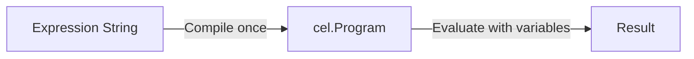

# CEL Overview

CEL (Common Expression Language) is Google's expression language for policy evaluation. ConductorOne uses CEL to let you encode access logic that would be impossible with dropdown menus.

## Why CEL for Authorization

These properties matter for access control:

| Property | Why It Matters |
|----------|----------------|
| **Fast** | Evaluates in microseconds - access decisions are in the critical path |
| **Bounded execution** | No loops means expressions always terminate - authorization cannot hang |
| **No side effects** | Policy evaluation cannot modify state or permissions |
| **Type-safe** | Errors caught when you save, not at 2 AM during emergency access |

## Where CEL is Used

| Environment | Returns | Example Use |
|-------------|---------|-------------|
| Policy Conditions | `bool` | Route requests to different approval workflows |
| Dynamic Groups | `bool` | Automatically maintain group membership |
| Policy Steps | `User` or `list<User>` | Dynamically select approvers |

## Basic Syntax

```cel
// Field access
subject.department == "Engineering"

// Boolean operators
subject.department == "Engineering" && task.is_grant_permanent

// Function calls
c1.directory.users.v1.GetManagers(subject)

// Ternary conditional
size(managers) > 0 ? managers : appOwners
```

## What's C1's vs Google's

| Layer | Google's CEL | ConductorOne's Extensions |
|-------|--------------|---------------------------|
| Syntax | All operators, macros (`has()`, `size()`) | Nothing added |
| Types | Primitives, lists, maps, timestamps | `User`, `Task`, `AppEntitlement` |
| Functions | String methods, math | `c1.directory.*`, `c1.user.*` |

**Rule of thumb:** If it starts with `c1.`, it's ConductorOne's extension.

## How Expressions are Evaluated



Expressions are compiled when you save and cached. Evaluation happens against specific users/requests in microseconds.
