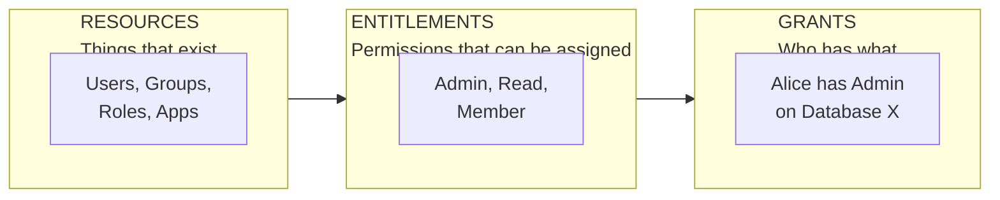

# concepts-resources

Resources, entitlements, grants, traits, and the access graph.

---

## The Access Graph

Your connector produces an access graph with three node types:



## Resources

Resources are things that exist in the target system:
- Users (individual accounts)
- Groups (collections of users)
- Roles (permission bundles)
- Apps (applications or services)
- Custom types (projects, repositories, teams)

Each resource has a **resource type** with optional **traits**.

## Traits

Traits tell ConductorOne how to interpret a resource:

| Trait | Use For |
|-------|---------|
| `TRAIT_USER` | Individual accounts |
| `TRAIT_GROUP` | Collections of users |
| `TRAIT_ROLE` | Permission sets |
| `TRAIT_APP` | Applications or services |
| `TRAIT_SECRET` | Credentials or tokens |

```go
var userResourceType = &v2.ResourceType{
    Id:          "user",
    DisplayName: "User",
    Traits:      []v2.ResourceType_Trait{v2.ResourceType_TRAIT_USER},
}
```

Marking a resource with `TRAIT_USER` enables:
- Correlation with users from other systems
- Display in user-centric views
- User-specific policies

## Entitlements

Entitlements define what can be granted. They attach to resources.

```go
entitlement := &v2.Entitlement{
    Id:          "member",
    DisplayName: "Member",
    Resource:    groupResource,
}
```

One resource can offer multiple entitlements. A GitHub repository might offer: read, write, maintain, admin.

## Grants

Grants record who has what:

```go
grant := &v2.Grant{
    Principal:   aliceResource,   // Who
    Entitlement: memberEntitlement, // What permission on what resource
}
```

A grant connects a **principal** (usually a user) to an **entitlement**.

## Hierarchical Resources

Resources can have parent-child relationships:
- GitHub: organizations contain repositories
- AWS: accounts contain services
- GCP: projects contain resources

Express hierarchy through `parentResourceID` in your `List()` method. The SDK calls `List()` with no parent first (top-level), then for each parent that has children.

This enables:
- Access shown in context (this role on *this* project)
- Scoped access reviews (all access within one org unit)
- Inheritance patterns where they exist
