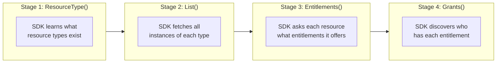
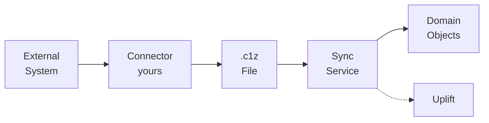

# concepts-sync

The four sync stages, pagination, and how the SDK orchestrates calls.

---

## The Four Stages

The SDK orchestrates sync in four stages:



**Example outputs:**
- Stage 1: user, group, role
- Stage 2: 127 users, 23 groups, 15 roles
- Stage 3: group-A offers "member", role-X offers "assigned"
- Stage 4: alice has "member" on group-A

## Inversion of Control

The SDK processes ALL resource types together for each stage, not one type completely before the next.

You define what to sync. The SDK decides when to call your methods.

This keeps connector code focused on data transformation, not orchestration.

## The ResourceSyncer Interface

Four methods give you a working connector:

```go
type ResourceSyncer interface {
    ResourceType(ctx) (*v2.ResourceType, error)
    List(ctx, parentResourceID, token) ([]*v2.Resource, string, annotations, error)
    Entitlements(ctx, resource, token) ([]*v2.Entitlement, string, annotations, error)
    Grants(ctx, resource, token) ([]*v2.Grant, string, annotations, error)
}
```

## Pagination

Each method returns:
- A list of results
- A `nextPageToken` string (empty when done)
- Optional annotations

The SDK handles pagination orchestration. You return items and the next token.

**Key invariant:** Your next token must progress. The SDK detects and errors on "same token" loops.

## The Sync Pipeline



1. **Fetch** - Your connector calls external API
2. **Transform** - Create Resource/Entitlement/Grant objects
3. **Output** - SDK writes to .c1z file (gzip SQLite)
4. **Ingest** - ConductorOne reads the file
5. **Uplift** - Raw records become domain objects

**You control:** Steps 1-3
**ConductorOne controls:** Steps 4-5
